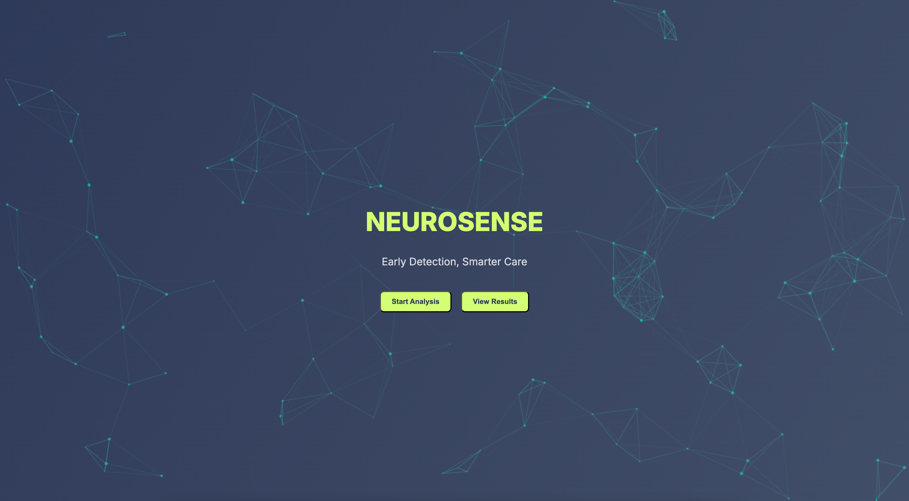

<p>
  
</p>

[](https://choosealicense.com/licenses/mit/)


# NeuroSense

NeuroSense - A Gaussian mixture model based tool for foreground detection of involuntary twitch movements called as fasiculation.

## Motivation


## Documentation

Documentation for Neurosense is available on Read the Docs.


## Product Highlights

<p align="center">
  
</p>


## Architecture


## Installation

Follow the steps below to set up and run the Flask application locally:

1. **Clone the Repository**

    ```bash
    git clone https://github.com/Dheeraj791/NeuroSense.git
    cd your-flask-app
    ```

2. **(Optional) Create and Activate a Virtual Environment**

    - **macOS/Linux:**
      ```bash
      python3 -m venv venv
      source venv/bin/activate
      ```

    - **Windows (CMD):**
      ```cmd
      python -m venv venv
      venv\Scripts\activate
      ```

    - **Windows (PowerShell):**
      ```powershell
      python -m venv venv
      venv\Scripts\Activate.ps1
      ```

3. **Install Dependencies**

    ```bash
    pip install -r requirements.txt
    ```

4. **Set Environment Variables**

    - **macOS/Linux:**
      ```bash
      export FLASK_APP=app.py
      export FLASK_ENV=development
      ```

    - **Windows (CMD):**
      ```cmd
      set FLASK_APP=app.py
      set FLASK_ENV=development
      ```

    - **Windows (PowerShell):**
      ```powershell
      $env:FLASK_APP = "app.py"
      $env:FLASK_ENV = "development"
      ```

5. **Run the Application**

    ```bash
    flask run
    ```

6. **Visit the App**

    Open your browser and go to:  
    [http://127.0.0.1:5000](http://127.0.0.1:5000)


    
## Features

- Single video upload
- Bulk video upload
- Live previews
- Fullscreen mode


## Contributing

Contributions are always welcome!

See `contributing.md` for ways to get started.

Please adhere to this project's `code of conduct`.


## Related Paper

Here are some related projects

[Bibbings et al. (2019)](https://www.sciencedirect.com/science/article/pii/S0301562919300274)


## Repo structure

```

├─ .DS_Store
├─ .gitignore
├─ CODE_OF_CONDUCT.md
├─ Code_files
│  └─ requirements.txt
├─ Documentation
│  └─ New_file
├─ LICENSE
├─ Paper
├─ README.md
├─ abstracts
│  └─ example
├─ app.py
├─ static
│  ├─ .DS_Store
│  ├─ css
│  │  └─ style.css
│  ├─ images
│  │  ├─ NEuroSense.png
│  │  └─ background.jpg
│  ├─ js
│  │  ├─ config.js
│  │  └─ script.js
│  └─ logo
│     └─ manmet.jpg
└─ templates
   ├─ bulk_results.html
   ├─ index.html
   └─ result.html
```

## Feedback

If you have any feedback, please reach out to us at pandey.dheeraj457@gmail.com